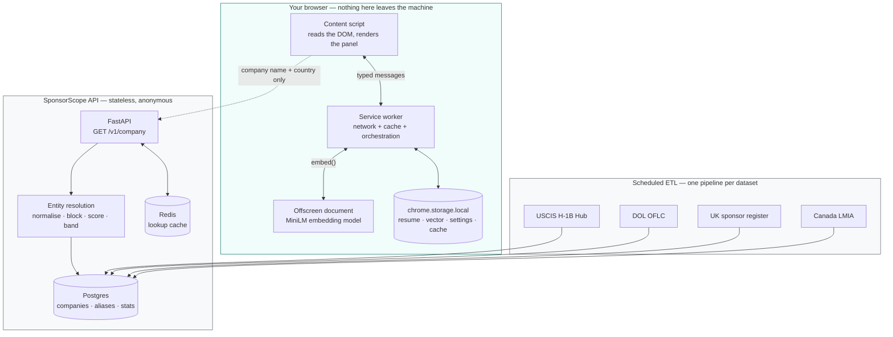

# SponsorScope

A free, open-source browser extension that shows visa-status-constrained job
seekers — H-1B holders, international students, and immigrants generally —
whether a company has a history of sponsoring work visas, how closely their
resume matches the posting, and where to look for interview information and a
referral. It runs on LinkedIn job and company pages, needs no account, and
computes the resume match entirely on your own machine.

**Status:** early. The extension, the API, and the ETL pipelines are built and
tested; there is no public deployment yet, and the LinkedIn selectors have not
been validated against a live logged-in session. See [Roadmap](#roadmap).

---

## Contents

- [What it does](#what-it-does)
- [What it deliberately does not do](#what-it-deliberately-does-not-do)
- [Architecture](#architecture)
- [Local setup](#local-setup)
- [How to add a new job board](#how-to-add-a-new-job-board)
- [How to add a new country](#how-to-add-a-new-country)
- [Data sources](#data-sources)
- [Privacy](#privacy)
- [Disclaimer](#disclaimer)
- [Contributing](#contributing)
- [Roadmap](#roadmap)
- [License](#license)

---

## What it does

**1. Sponsorship history.** Looks the employer up in government open data — the
USCIS H-1B Employer Data Hub and DOL OFLC disclosures for the US, the Home
Office register of licensed sponsors for the UK, and the ESDC positive-LMIA list
for Canada — and shows what was actually filed, with the source and the date the
data was published. Where no register covers the country, it falls back to
reading the posting's own wording (below), clearly labelled as unverified.

**2. Resume fit.** Scores your resume against this specific job description
using a sentence-embedding model that runs in your browser. Semantic, not
keyword matching. Your resume is stored in `chrome.storage.local` and is never
uploaded — there is no endpoint that would accept it.

**3. Interview process.** Deep links to Glassdoor, Blind, and web search,
scoped to the company. Links only; nothing is fetched or aggregated.

**4. Referral discovery.** Deep links into the company's own LinkedIn People
tab, pre-filtered for recruiters, engineering managers, and potential peers.
Again: links, opened in a tab, under your own session.

### The distinctions the UI is built around

Three product rules drive most of the design, and they are enforced in the types
rather than left to the renderer:

| Distinction | Why it matters |
| --- | --- |
| **No record found** vs. **does not sponsor** | These are separate variants of a tagged union, not one nullable count. Small employers, recent sponsors, and subsidiaries filing under a parent name are routinely absent from these datasets. Absence of a filing is not evidence of a policy. |
| **Verified** vs. **mentioned in the posting** | Government data and an employer's own marketing copy are different kinds of claim. They render in different colours, with different icons, different border styles, and different words. |
| **Certain match** vs. **possible match** | Matching "Acme" on a job board to "ACME HOLDINGS INTERNATIONAL LLC" in a filing is genuinely hard. Every result carries a confidence band, and a low-confidence match renders as "verify independently" with a one-click way to report it. |

---

## What it deliberately does not do

These are constraints, not unimplemented features. Changing any of them is a
project-level decision, not a PR.

- **No accounts, no login, no server-side user data.** The backend has no user
  table, no session table, and no credential of any kind. It cannot identify a
  caller because it never receives anything that would let it.
- **No automated interaction with any job board.** The extension reads the DOM
  of a page you are already looking at. It does not drive a headless browser,
  call undocumented internal APIs, or run searches on your behalf. Where we want
  to point you at a LinkedIn or Glassdoor result, we build a URL and open a tab.
- **No remote code.** The embedding model is vendored at build time and loaded
  from inside the extension bundle. Nothing executable is fetched at runtime.
- **No dark mode.** Light theme only, by product decision.
- **Minimal permissions.** `activeTab` rather than `tabs`; path-scoped host
  matches rather than `https://www.linkedin.com/*`; broad host access requested
  at the moment of use, not up front.

---

## Architecture



The request that crosses the boundary carries a company name, and a country when
we can infer one. That is all. No resume, no job description, no page URL, no
identifier, no cookie.

### Repository layout

```
extension/
  src/design/tokens.ts        Single source of truth for the design system;
                              tokens.css is generated from it at build time.
  src/adapters/               One module per job board. types.ts is the contract.
  src/content/                Panel rendering + SPA navigation detection.
  src/background/             Service worker: API client, cache, offscreen lifecycle.
  src/offscreen/              Hosts the embedding model.
  src/lib/                    Phrase detection, resume scoring, deep links, storage.
  scripts/                    esbuild build, token codegen, icon codegen, model fetch.

backend/
  app/resolution/             Entity resolution. Read this before touching thresholds.
  app/sources.py              Provenance registry. Every figure cites an entry here.
  app/service.py              Lookup logic, independent of HTTP.
  app/api/v1.py               Public endpoints. No auth, rate limited per IP.
  etl/                        One module per dataset + a shared loader.
```

---

## Local setup

### Prerequisites

Node 20+, Python 3.11+, and either Docker or a local Postgres 14+ and Redis.
Postgres must be 14 or newer for the `pg_trgm` blocking indexes.

### Extension

```bash
cd extension
npm install
npm run fetch:model     # vendors the ~23MB embedding model; run once
npm run build
```

Then load it in Chrome:

1. Open `chrome://extensions`
2. Turn on **Developer mode** (top right)
3. Click **Load unpacked** and select `extension/dist`
4. Open any LinkedIn job posting

`npm run dev` rebuilds on change. Chrome does not hot-reload extensions — click
the reload icon on the card in `chrome://extensions`, then refresh the page.

Without `npm run fetch:model` everything works except resume matching, which
reports itself as unavailable rather than failing silently.

By default the extension points at `https://api.sponsorscope.dev`, which does
not exist yet. For local development, open the extension's options page and set
the API base URL to `http://localhost:8000`.

### Backend

```bash
docker compose up -d          # Postgres + Redis
cd backend
uv venv && uv pip install -e ".[dev]"
python -m app.init_db         # schema + pg_trgm indexes
uvicorn app.main:app --reload
```

`http://localhost:8000/docs` has the interactive API reference.
`GET /v1/health` reports database, cache, and data-staleness status — a
successful boot with no data is a healthy service that correctly answers
`no_record` to everything.

Redis is optional: if it is unreachable the API logs a warning, serves
uncached, and falls back to in-process rate limiting. Postgres is not optional;
without it lookups return `503`, which the extension renders as a service error
rather than as a finding about any company.

### Loading real data

The publishers do not offer stable URLs, so downloads are a manual step.

```bash
cd backend

# 1. Download a fiscal-year CSV from the USCIS H-1B Employer Data Hub:
#    https://www.uscis.gov/tools/reports-and-studies/h-1b-employer-data-hub
python -m etl.run ingest uscis_h1b_hub --file ./h1b_fy2024.csv --published 2025-01-15

# 2. Curated aliases — this is what connects "Amazon" to "AMAZON.COM SERVICES LLC"
python -m etl.run seed-aliases --file seed/aliases.csv

# What is registered, and on what cadence
python -m etl.run sources
```

`--published` is the date the *publisher* released the file, not today. It is
shown to users as the "as of" date, so getting it wrong misrepresents how
current the data is.

### Tests

```bash
cd extension && npm test          # 123 tests
cd backend   && pytest            # 83 tests
```

Neither suite needs a database or network access.

---

## How to add a new job board

The adapter pattern exists for exactly this. Nothing in `src/content`,
`src/background`, or `src/lib` should need to change.

**1. Write the adapter.** Implement `JobBoardAdapter` from
[`src/adapters/types.ts`](extension/src/adapters/types.ts):

```ts
export const indeedAdapter: JobBoardAdapter = {
  id: 'indeed',
  label: 'Indeed',
  matches(url) { /* hostname check, cheap and side-effect free */ },
  detectPageType(url, doc) { /* 'job_posting' | 'company' | null */ },
  extract(url, doc) { /* PageContext, or null if the page is not ready yet */ },
  findPanelAnchor(pageType, doc) { /* the element to insert after */ },
};
```

**2. Use the safe helpers.** `safeQuery`, `safeText`, and `safeBlockText` take a
*list* of selectors and return `undefined` rather than throwing. Job boards
change their DOM without notice, and an exception inside a content script takes
the whole panel down. A missing field must produce a degraded panel, never a
crash and never a guess.

**3. Return `null` from `extract` when the page has not finished rendering.**
The content script distinguishes "not ready" (retry on the next mutation) from
"not our page" (do nothing). Returning a half-populated context instead of
`null` is the most common way to get a panel showing the previous job's company.

**4. Use `safeBlockText` for the job description.** It preserves line
structure. The phrase scanner splits on line and sentence boundaries, and
flattening a bulleted list into one line merges unrelated clauses and breaks
negation scoping — "Must have right to work" and "Visa sponsorship available"
become one clause and one of them wins arbitrarily.

**5. Give postings a stable key.** Many boards render postings into a pane
without changing the path. `PageContext.key` is what suppresses redundant
re-renders and what distinguishes one posting from the next; see `jobKey` in the
LinkedIn adapter for the `currentJobId` case.

**6. Register it** in [`src/adapters/registry.ts`](extension/src/adapters/registry.ts)
and add the paths to `content_scripts.matches` in
[`public/manifest.json`](extension/public/manifest.json). Keep the match
patterns path-exhaustive — `https://www.indeed.com/viewjob*`, not
`https://www.indeed.com/*`.

**7. Test the contract**, not the selectors. See
[`tests/linkedin-adapter.test.ts`](extension/tests/linkedin-adapter.test.ts):
that a missing element degrades, that a partial page reports not-ready, and that
page keys distinguish postings. Selector fixtures cannot prove the adapter works
against the live site — only running it can.

---

## How to add a new country

**1. Register the source** in [`app/sources.py`](backend/app/sources.py). Every
field is required, and `means` is user-facing copy: one honest sentence about
what the data actually proves. `cadence` documents how often the publisher
releases, which is what the ETL schedule should match.

**2. Write the pipeline.** Subclass `Pipeline` from
[`etl/base.py`](backend/etl/base.py) and yield `StatRecord`s:

```python
StatRecord(
    company_name="ACME LTD",   # raw legal name; the loader normalises it
    country="IE",
    metric="ie_permits_granted",
    value=42.0,
    year=2025,                 # None for current-status registers
    published_date=date(2025, 7, 1),
    source_id="ie_employment_permits",
)
```

Conventions the loader relies on:

- **Do not normalise `company_name`.** The loader does, so normalisation stays
  consistent across every source and changes in one place.
- **Name metrics `<country>_<what>`,** lowercase, and keep semantically
  different figures separate. Do not sum initial and continuing H-1B approvals
  into one number: an employer with 400 continuing and 2 initial approvals is
  maintaining a population, not hiring, and that is the distinction a candidate
  most needs.
- **Use `year=None`** for registers that publish current status rather than
  yearly filings, and emit a `1.0` flag rather than a fake count. See the UK
  pipeline.
- **Use `find_column`** rather than exact header indexing. These publishers
  rename headers between releases; `find_column` matches case- and
  punctuation-insensitively and raises with the available columns listed, so a
  rename fails loudly at ingest instead of silently producing zero rows.

**3. Add fixtures and tests.** Copy a handful of real rows — including the messy
ones: blank names, `-` and `N/A` cells, thousands separators, duplicate
employers across rows — into `backend/tests/fixtures/` and assert against them.
See [`test_etl_parsing.py`](backend/tests/test_etl_parsing.py).

**4. Register the pipeline** in `PIPELINES` in
[`etl/run.py`](backend/etl/run.py), and add the country to
`SUPPORTED_COUNTRIES` in [`app/service.py`](backend/app/service.py) and to
`COVERED_COUNTRIES` in [`extension/src/lib/country.ts`](extension/src/lib/country.ts).

**5. Add metric labels** to `METRIC_LABELS` in
[`extension/src/content/panel.ts`](extension/src/content/panel.ts), or the panel
shows the raw metric key.

**6. Consider aliases.** Fuzzy matching cannot bridge brand names to legal
entity names. If the country's data uses registered names, add the common
employers to `backend/seed/aliases.csv`.

---

## Data sources

All sources are public-domain or open-government-licensed. Details, terms, and
the caveats attached to each are in [`docs/data-sources.md`](docs/data-sources.md).

| Country | Source | Publisher | Cadence | Shape |
| --- | --- | --- | --- | --- |
| US | [H-1B Employer Data Hub](https://www.uscis.gov/tools/reports-and-studies/h-1b-employer-data-hub) | USCIS | Annual, per fiscal year | Petition approval/denial counts |
| US | [OFLC PERM disclosures](https://www.dol.gov/agencies/eta/foreign-labor/performance) | DOL | Quarterly | Green-card labour certifications |
| US | [OFLC LCA disclosures](https://www.dol.gov/agencies/eta/foreign-labor/performance) | DOL | Quarterly | H-1B prerequisite filings |
| UK | [Register of Licensed Sponsors: Workers](https://www.gov.uk/government/publications/register-of-licensed-sponsors-workers) | UKVI | Near-daily | Current licence status, no counts |
| CA | [Positive LMIA Employers List](https://open.canada.ca/data/en/dataset/90fed587-1364-4f33-a9ee-208181dc0b97) | ESDC | Quarterly | Approved positions by NOC |

Everywhere else, the extension falls back to reading the posting's own text.

### The posting-text fallback is negation-aware

"We sponsor visas" and "We do not sponsor visas" share every keyword that
matters, and a presence check reports both as positive. The detector in
[`sponsorship-phrases.ts`](extension/src/lib/sponsorship-phrases.ts) splits text
into clauses, classifies anchors as *offers* (positive unless negated) or
*requirements* (negative unless negated — which is how "right to work not
required" comes out positive), scans for negation within punctuation-bounded
windows, and ignores interrogative clauses so the ubiquitous "Will you now or in
the future require sponsorship?" screening question is not read as an offer.
Ties resolve to negative: over-claiming sponsorship costs someone an application
and a rejection.

It is covered by 51 tests written from phrasings observed in real postings. When
you find a false positive, add the sentence to the test file first.

---

## Privacy

Full detail in [`docs/privacy.md`](docs/privacy.md). In short:

**Stored on your device only** (`chrome.storage.local`, never transmitted):
your resume text, its computed embedding, your settings, and a cache of previous
lookups. The options page has a **Delete my resume** control that removes the
text and everything derived from it in one operation.

**Sent to the backend:** the company name shown on the posting, and its country
when we can infer one. Nothing else. No resume, no job description, no page URL,
no identifier, no cookie — and the API sets none.

**Stored on the backend:** a per-day counter of how many times each normalised
company name was looked up, used to decide which companies need alias curation.
There is no IP, user agent, session, or request ordering stored alongside it, so
it cannot be turned into a profile. Client IPs are used transiently for rate
limiting and are not persisted.

**Never collected:** anything else.

---

## Disclaimer

SponsorScope provides informational signals derived from historical public
government data. **It is not legal or immigration advice.**

- A sponsorship history is not a guarantee of current policy. Companies stop
  sponsoring, change policy by team, and treat roles differently.
- Absence from a dataset is not evidence that a company does not sponsor. Small
  employers, recent sponsors, and companies filing under a parent or subsidiary
  name are routinely missing. Canada's list additionally excludes any employer
  whose legal name contains a personal name.
- Entity matching is imperfect. A "possible match" means we are not confident
  the figures describe the company you are looking at.
- The resume score compares wording between two documents. It is not a
  prediction about a hiring outcome.

Consult a qualified immigration attorney for advice about your situation.

---

## Contributing

See [CONTRIBUTING.md](CONTRIBUTING.md). Particularly welcome:

- **Company aliases** (`backend/seed/aliases.csv`) — the highest-value, lowest-
  friction contribution, and the main thing limiting match quality.
- **False positives and negatives in the posting-text detector** — open an issue
  with the exact sentence.
- **Wrong entity matches** — the panel has a report link that pre-fills an issue.
- **New job boards and new countries** — see the guides above.

---

## Roadmap

**Built**

- [x] Manifest V3 extension, LinkedIn adapter for job and company pages
- [x] Design tokens with generated CSS, WCAG AA contrast enforced by test
- [x] Sponsorship lookup API, entity resolution with confidence bands
- [x] ETL for USCIS H-1B, UK sponsor register, Canada LMIA
- [x] Negation-aware posting-text detection
- [x] On-device resume matching
- [x] Interview and referral deep links
- [x] Cache schema versioning and migration

**Before a public release**

- [ ] **Verify the LinkedIn selectors and people-search URL parameters against a
      live logged-in session.** The URL shapes in `deeplinks.ts` reflect the
      documented scheme, not one confirmed by hand. LinkedIn changes both.
- [ ] Deploy the API and replace the `api.sponsorscope.dev` placeholder
- [ ] DOL OFLC PERM/LCA pipelines (registered as sources; pipelines not written)
- [ ] Automatic dataset discovery, so ingestion is not a manual download
- [ ] Chrome Web Store listing and privacy disclosure

**Planned**

- [ ] Indeed and Glassdoor adapters
- [ ] Firefox port (the manifest is close; `chrome.offscreen` needs a shim)
- [ ] More countries — Ireland, Netherlands, Australia, Germany
- [ ] Optional richer rationale behind a pluggable LLM backend (local Ollama or
      a hosted API), off by default, with the resume staying on-device

---

## License

MIT — see [LICENSE](LICENSE). The government data is public domain or
open-government-licensed; see [`docs/data-sources.md`](docs/data-sources.md) for
per-source terms.
